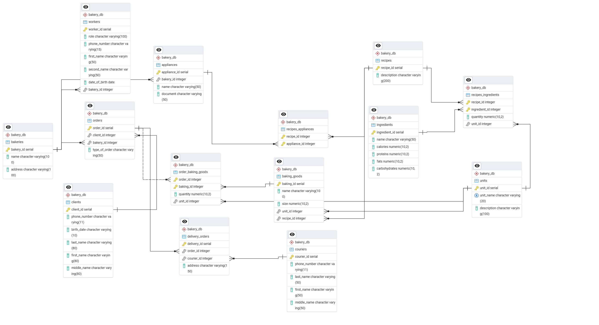

1 -  Нарушение атомарности (1 НФ) – два разных поля для одного смыслового признака (количества) в таблицах recipes_ingredients,  baking_goods, order_baking_goods:
   
**Решение** – создание таблицы для хранения единиц:

### units

CREATE TABLE bakery_db.units (
    unit_id SERIAL PRIMARY KEY,
    unit_name VARCHAR(20) NOT NULL UNIQUE, -- например, "g", "ml", "pcs"
    description VARCHAR(100)
);

INSERT INTO bakery_db.units (unit_name, description) VALUES
('g', 'граммы'),
('ml', 'миллилитры'),
('pcs', 'штуки');

### baking_goods

CREATE TABLE bakery_db.baking_goods (
    baking_id SERIAL PRIMARY KEY,
    name VARCHAR(100) NOT NULL,
    size NUMERIC(10,2) NOT NULL,
    unit_id INT NOT NULL,
    recipe_id INT NOT NULL
);

ALTER TABLE bakery_db.baking_goods
    ADD CONSTRAINT fk_baking_goods_recipe
        FOREIGN KEY (recipe_id)
        REFERENCES bakery_db.recipes(recipe_id)
        ON DELETE CASCADE;

ALTER TABLE bakery_db.baking_goods
    ADD CONSTRAINT fk_baking_goods_unit
        FOREIGN KEY (unit_id)
        REFERENCES bakery_db.units(unit_id)
        ON DELETE RESTRICT;

### recipes_ingredients

CREATE TABLE bakery_db.recipes_ingredients (
    recipe_id INT NOT NULL,
    ingredient_id INT NOT NULL,
    quantity NUMERIC(10,2) NOT NULL,
    unit_id INT NOT NULL,
    PRIMARY KEY (recipe_id, ingredient_id)
);

ALTER TABLE bakery_db.recipes_ingredients
    ADD CONSTRAINT fk_recipes_ingredients_recipe
        FOREIGN KEY (recipe_id)
        REFERENCES bakery_db.recipes(recipe_id)
        ON DELETE CASCADE;

ALTER TABLE bakery_db.recipes_ingredients
    ADD CONSTRAINT fk_recipes_ingredients_ingredient
        FOREIGN KEY (ingredient_id)
        REFERENCES bakery_db.ingredients(ingredient_id)
        ON DELETE CASCADE;

ALTER TABLE bakery_db.recipes_ingredients
    ADD CONSTRAINT fk_recipes_ingredients_unit
        FOREIGN KEY (unit_id)
        REFERENCES bakery_db.units(unit_id)
        ON DELETE RESTRICT;

### order_baking_goods

CREATE TABLE bakery_db.order_baking_goods (
    order_id INT NOT NULL,
    baking_id INT NOT NULL,
    quantity NUMERIC(10,2) NOT NULL,
    unit_id INT NOT NULL,
    PRIMARY KEY (order_id, baking_id)
);

ALTER TABLE bakery_db.order_baking_goods
    ADD CONSTRAINT fk_order_baking_goods_order
        FOREIGN KEY (order_id)
        REFERENCES bakery_db.orders(order_id)
        ON DELETE CASCADE;

ALTER TABLE bakery_db.order_baking_goods
    ADD CONSTRAINT fk_order_baking_goods_baking
        FOREIGN KEY (baking_id)
        REFERENCES bakery_db.baking_goods(baking_id)
        ON DELETE CASCADE;

ALTER TABLE bakery_db.order_baking_goods
    ADD CONSTRAINT fk_order_baking_goods_unit
        FOREIGN KEY (unit_id)
        REFERENCES bakery_db.units(unit_id)
        ON DELETE RESTRICT;

2 - Поле full_name в clients и couriers не атомарно (1 НФ). 

####  Решение: Разбиваем на три поля — фамилию, имя, отчество.

ALTER TABLE bakery_db.clients
ADD COLUMN last_name VARCHAR(80),
ADD COLUMN first_name VARCHAR(80),
ADD COLUMN middle_name VARCHAR(80);

UPDATE bakery_db.clients
SET last_name = split_part(full_name, ' ', 1),
first_name = split_part(full_name, ' ', 2),
middle_name = split_part(full_name, ' ', 3);

ALTER TABLE bakery_db.clients DROP COLUMN full_name;

ALTER TABLE bakery_db.couriers
    ADD COLUMN last_name VARCHAR(50),
    ADD COLUMN first_name VARCHAR(50),
    ADD COLUMN middle_name VARCHAR(50);

UPDATE bakery_db.couriers
SET last_name = split_part(full_name, ' ', 1),
    first_name = split_part(full_name, ' ', 2),
    middle_name = NULLIF(split_part(full_name, ' ', 3), '');

ALTER TABLE bakery_db.couriers
    DROP COLUMN full_name;

3 - В таблице recipes хранятся поля calories, proteins, fats, carbohydrates, которые представляют собой агрегированные показатели, вычисляемые из состава ингредиентов. Это создаёт транзитивную зависимость (через recipes_ingredients → ingredients), нарушающую 3НФ.
Кроме того, это вызывает риск дублирования и несогласованности данных — если изменить ингредиенты, калорийность рецепта может измениться, но значения в таблице recipes останутся прежними.

#### Решение – не хранить нутриенты в recipes, а вычислять их динамически из состава и ингредиентов.

ALTER TABLE bakery_db.recipes
    DROP COLUMN IF EXISTS calories,
    DROP COLUMN IF EXISTS proteins,
    DROP COLUMN IF EXISTS fats,
    DROP COLUMN IF EXISTS carbohydrates;

