## Задание: Поднять PostgreSQL в Docker
PostgreSql и Flyway поднимаю через docker-compose.yaml 
``` yaml
version: '3.8'

services:
  postgres:
    image: postgres:15
    container_name: bakery_db_2_semester
    restart: unless-stopped
    environment:
      POSTGRES_USER: admin
      POSTGRES_PASSWORD: adminpass
      POSTGRES_DB: bakery_db_2_semester
    ports:
      - "5438:5432"                     
    volumes:
      - postgres_data:/var/lib/postgresql/data
    healthcheck:
      test: ["CMD-SHELL", "pg_isready -U admin -d bakery_db_2_semester"]
      interval: 5s
      timeout: 5s
      retries: 5

  flyway:
    image: flyway/flyway:latest
    container_name: flyway_migrations
    command: -url=jdbc:postgresql://postgres:5432/bakery_db_2_semester -user=admin -password=adminpass migrate   
    volumes:
      - ./sql:/flyway/sql   
    depends_on:
      postgres:
        condition: service_healthy
    restart: "no"

volumes:
  postgres_data:
```
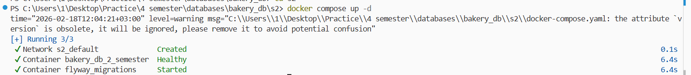


Контейнер действительно работает, к нему можно подключиться:
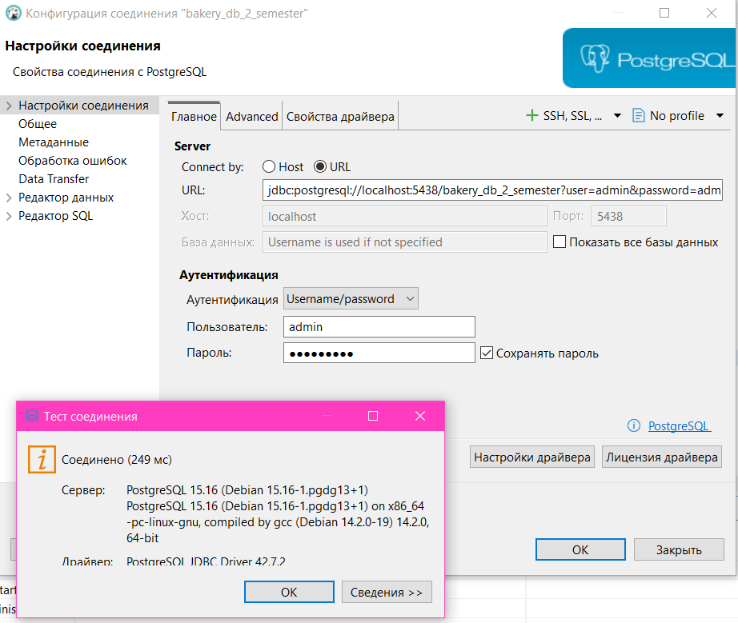
## Задание: Создать роли и выдать права (минимум 3)
Создание роли admin, app, analyst и выдача прав:
``` sql
CREATE ROLE readonly WITH LOGIN PASSWORD 'readonly_pass';
CREATE ROLE app WITH LOGIN PASSWORD 'app_pass';
CREATE ROLE analyst WITH LOGIN PASSWORD 'analyst_pass';   


GRANT CONNECT ON DATABASE bakery_db_2_semester TO readonly, app, analyst;
GRANT USAGE ON SCHEMA public TO readonly, app, analyst;

ALTER DEFAULT PRIVILEGES IN SCHEMA public 
GRANT SELECT, INSERT, UPDATE, DELETE ON TABLES TO app;

ALTER DEFAULT PRIVILEGES IN SCHEMA public 
GRANT SELECT ON TABLES TO readonly;

ALTER DEFAULT PRIVILEGES IN SCHEMA public 
GRANT SELECT ON TABLES TO analyst;  

GRANT TEMPORARY ON DATABASE bakery_db_2_semester TO analyst;
```
Однако, операции GRANT придётся повторить после миграций.

## Применить миграции (минимум 3)
Всего 3 миграции: создание таблиц, удаление нескольких столбцов из таблицы recipes и функция для добавления заказа. Для их применения запускаю Flyway через Docker.
После миграций:
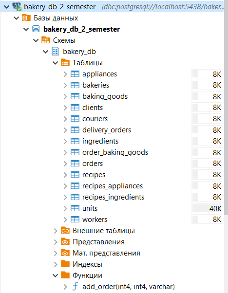

## Залить данные (250-500 к+ на 2-3 основные таблицы)
Данные залиты в таблицы bakeries, clients и workers через скрипты на python (generate_bakeries.py, generate_clients.py, generate_workers.py)
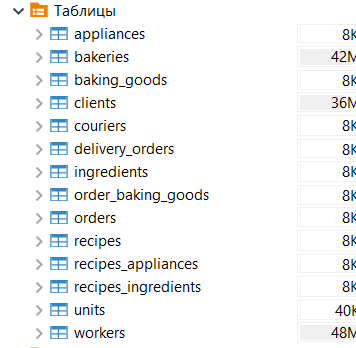
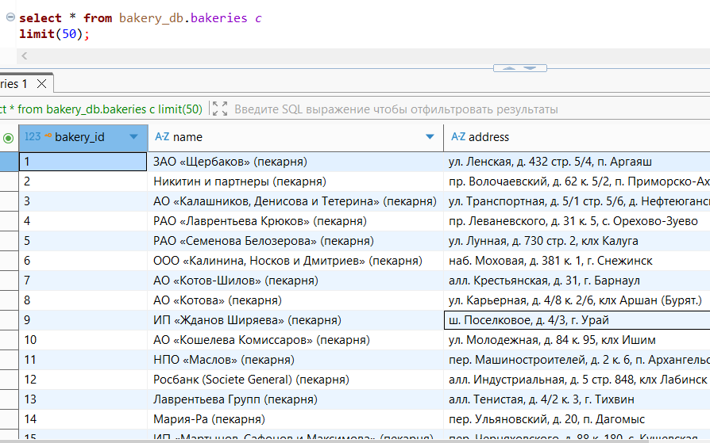

## Проверить доступ (ролей).
### Роль readonly
Сначала подключаемся к базе данных:
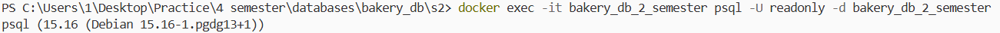
Выполняем обычный SELECT (должен работать):
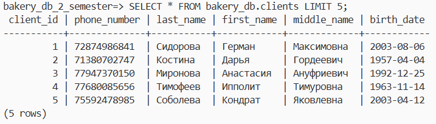
Выполняем INSERT (не должен работать):
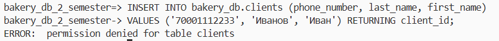
### Роль app
Сначала подключаемся к базе данных:
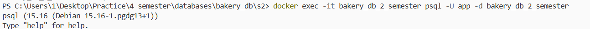
Выполняем INSERT (должен работать):

Пытаемся удалить таблицу клиентов (не должен работать):

### Роль analyst
Сначала подключаемся к базе данных и выполняем SELECT (должен работать):
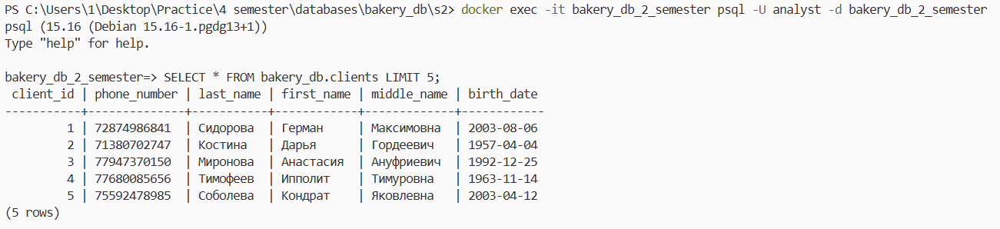
Попытка выполнить обновление (не должна работать):
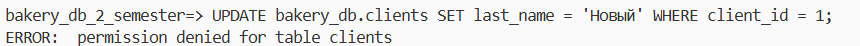
Проверка возможности работы с временными таблицами:
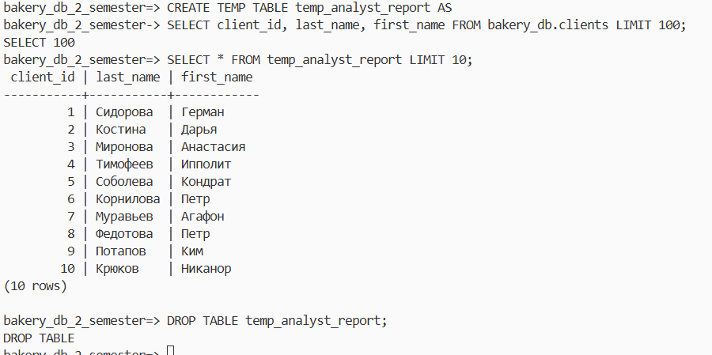