## SQL запросы (>, <, =, %like, like%, IN)
``` sql
SELECT * FROM BAKERY_DB.WORKERS 
WHERE DATE_OF_BIRTH > '1999-01-01';

SELECT * FROM BAKERY_DB.WORKERS 
WHERE DATE_OF_BIRTH < '1999-01-01';

UPDATE BAKERY_DB.WORKERS 
SET EMAIL = 'defaultemail@gmail.com'
WHERE worker_id = 1000;

SELECT * FROM BAKERY_DB.CLIENTS 
WHERE FIRST_NAME LIKE 'Ир%';

SELECT * FROM BAKERY_DB.WORKERS 
WHERE SECOND_NAME LIKE '%ва';

SELECT * FROM BAKERY_DB.CUSTOMER_FEEDBACK 
WHERE DATE(CREATED_AT) IN ('2025-01-01', '2025-01-15', '2025-02-01');
```
## ДЛЯ ПОИСКА РАБОТНИКОВ С ДАТОЙ РОЖДЕНИЯ > 1999-01-01
``` sql
EXPLAIN SELECT * FROM BAKERY_DB.WORKERS WHERE DATE_OF_BIRTH > '1999-01-01';

EXPLAIN ANALYZE SELECT * FROM BAKERY_DB.WORKERS WHERE DATE_OF_BIRTH > '1999-01-01';

EXPLAIN (ANALYZE, BUFFERS) SELECT * FROM BAKERY_DB.WORKERS WHERE DATE_OF_BIRTH > '1999-01-01';

CREATE INDEX idx_workers_birth ON bakery_db.workers(date_of_birth);

DROP INDEX IF EXISTS bakery_db.idx_workers_birth;

CREATE INDEX idx_workers_birth_hash ON bakery_db.workers USING HASH (date_of_birth);
```
#### Без индекса:
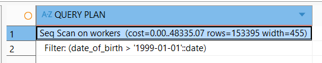
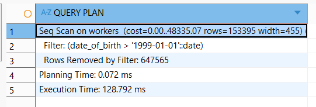
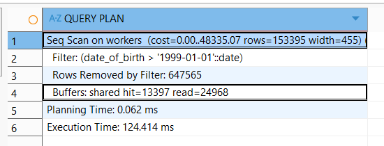
#### С индексом b-tree:
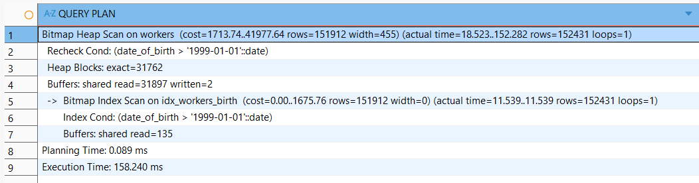
#### С индексом hash:
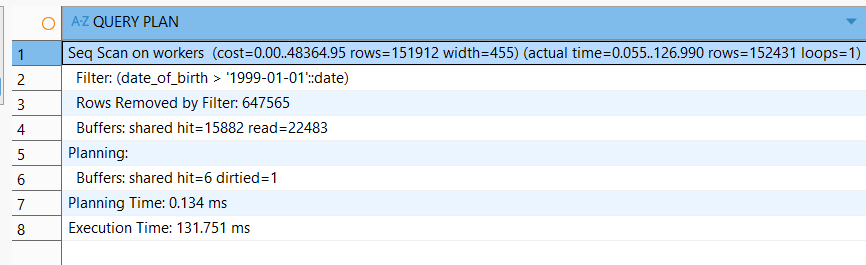


## EXPLAIN ДЛЯ ПОИСКА РАБОТНИКОВ С ДАТОЙ РОЖДЕНИЯ < 1999-01-01
``` sql
EXPLAIN SELECT * FROM BAKERY_DB.WORKERS WHERE DATE_OF_BIRTH < '1999-01-01';

EXPLAIN ANALYZE SELECT * FROM BAKERY_DB.WORKERS WHERE DATE_OF_BIRTH < '1999-01-01';

EXPLAIN (ANALYZE, BUFFERS) SELECT * FROM BAKERY_DB.WORKERS WHERE DATE_OF_BIRTH < '1999-01-01';

CREATE INDEX idx_workers_birth ON bakery_db.workers(date_of_birth);

DROP INDEX IF EXISTS bakery_db.idx_workers_birth;

CREATE INDEX idx_workers_birth_hash ON bakery_db.workers USING HASH (date_of_birth);
```
#### Без индекса
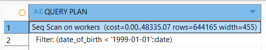
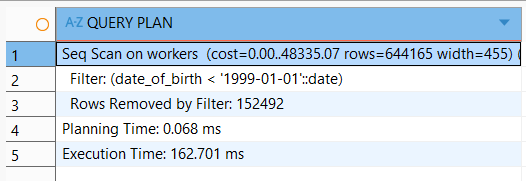
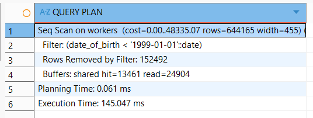
#### С индексом b-tree:
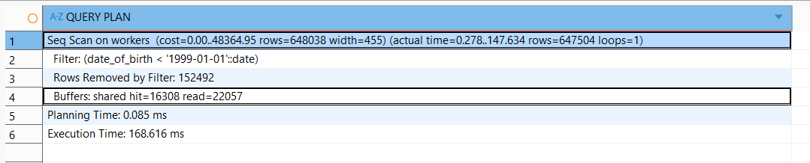
#### С индексом hash:
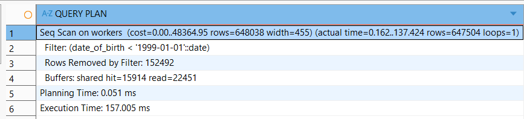

## ДЛЯ ОБНОВЛЕНИЯ EMAIL
``` sql
EXPLAIN UPDATE BAKERY_DB.WORKERS 
SET EMAIL = 'defaultemail@gmail.com'
WHERE worker_id = 1000;

EXPLAIN ANALYZE UPDATE BAKERY_DB.WORKERS 
SET EMAIL = 'defaultemail@gmail.com'
WHERE worker_id = 1000;

EXPLAIN (ANALYZE, BUFFERS) UPDATE BAKERY_DB.WORKERS 
SET EMAIL = 'defaultemail@gmail.com'
WHERE worker_id = 1000;

CREATE INDEX idx_workers_email ON bakery_db.workers(email);

DROP INDEX IF EXISTS bakery_db.idx_workers_email;

CREATE INDEX idx_workers_email_hash ON bakery_db.workers USING HASH (email);
```
#### Без индекса
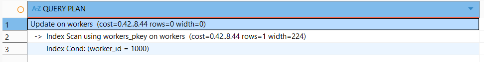
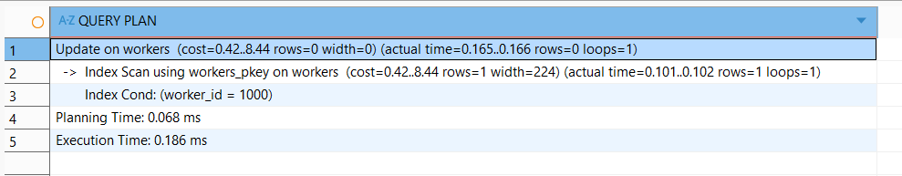
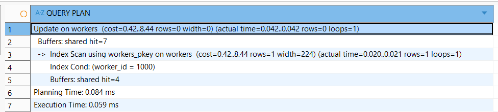
#### С индексом b-tree:
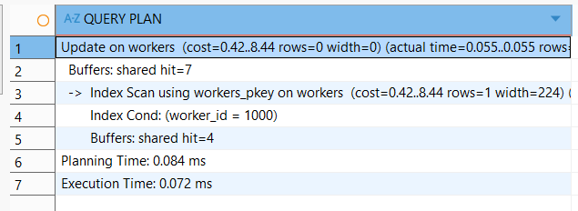
#### С индексом hash:
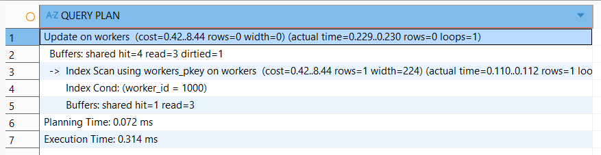

## ДЛЯ ПОИСКА КЛИЕНТОВ ПО ИМЕНИ, НАЧИНАЮЩЕГОСЯ С "ИР"
``` sql
EXPLAIN SELECT * FROM BAKERY_DB.CLIENTS 
WHERE FIRST_NAME LIKE 'Ир%';

EXPLAIN ANALYZE SELECT * FROM BAKERY_DB.CLIENTS 
WHERE FIRST_NAME LIKE 'Ир%';

EXPLAIN (ANALYZE, BUFFERS) SELECT * FROM BAKERY_DB.CLIENTS 
WHERE FIRST_NAME LIKE 'Ир%';

CREATE INDEX idx_clients_first_name ON bakery_db.clients(first_name);

DROP INDEX IF EXISTS bakery_db.idx_clients_first_name;

CREATE INDEX idx_clients_first_name_hash ON bakery_db.clients USING HASH (first_name);
```
#### Без индекса
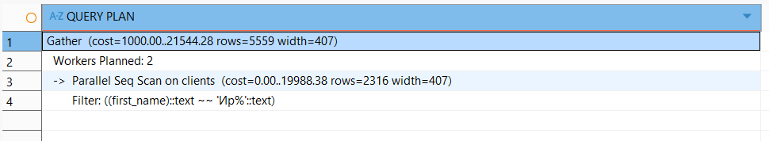
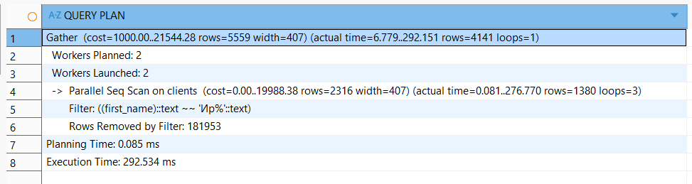
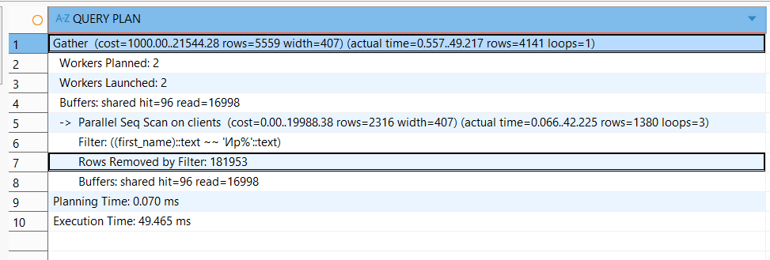
#### С индексом b-tree:
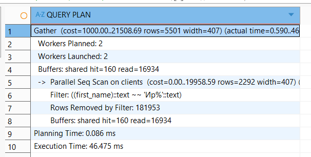
#### С индексом hash:
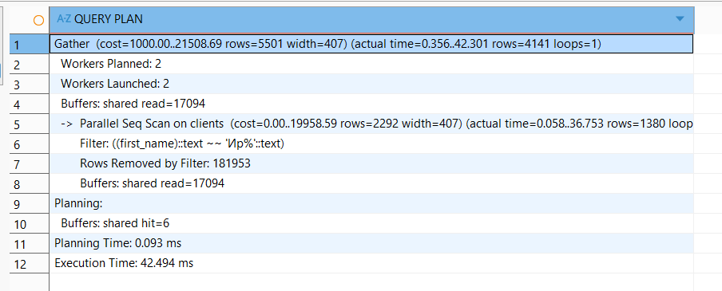

## ДЛЯ ПОИСКА РАБОТНИКОВ ПО ФАМИЛИИ, ЗАКАНЧИВАЮЩЕЙСЯ НА "ВА"
``` sql
EXPLAIN SELECT * FROM BAKERY_DB.WORKERS 
WHERE SECOND_NAME LIKE '%ва';

EXPLAIN ANALYZE SELECT * FROM BAKERY_DB.WORKERS 
WHERE SECOND_NAME LIKE '%ва';

EXPLAIN (ANALYZE, BUFFERS) SELECT * FROM BAKERY_DB.WORKERS 
WHERE SECOND_NAME LIKE '%ва';

CREATE INDEX idx_workers_second_name ON bakery_db.workers(second_name);

DROP INDEX IF EXISTS bakery_db.idx_workers_second_name;

CREATE INDEX idx_workers_second_name_hash ON bakery_db.workers USING HASH (second_name);
```
#### Без индекса
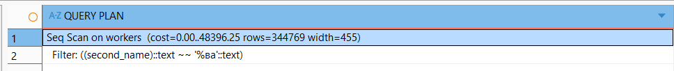
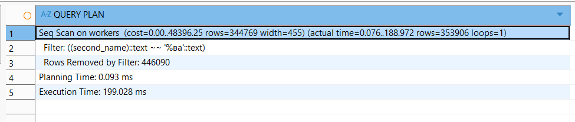
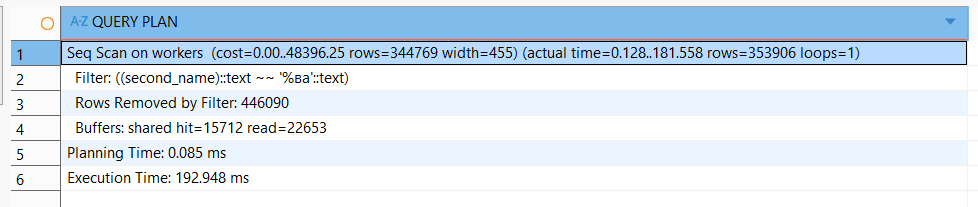
#### С индексом b-tree:
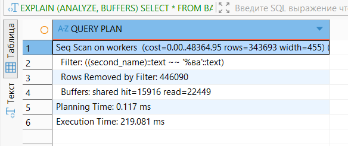
#### С индексом hash:


## ДЛЯ ПОИСКА ОТЗЫВОВ ПО ДАТАМ
``` sql
EXPLAIN SELECT * FROM BAKERY_DB.CUSTOMER_FEEDBACK 
WHERE DATE(CREATED_AT) IN ('2025-01-01', '2025-01-15', '2025-02-01');

EXPLAIN ANALYZE SELECT * FROM BAKERY_DB.CUSTOMER_FEEDBACK 
WHERE DATE(CREATED_AT) IN ('2025-01-01', '2025-01-15', '2025-02-01');

EXPLAIN (ANALYZE, BUFFERS) SELECT * FROM BAKERY_DB.CUSTOMER_FEEDBACK 
WHERE DATE(CREATED_AT) IN ('2025-01-01', '2025-01-15', '2025-02-01');

CREATE INDEX idx_customer_feedback_created_at ON bakery_db.customer_feedback(created_at);

DROP INDEX IF EXISTS bakery_db.idx_customer_feedback_created_at;

CREATE INDEX idx_customer_feedback_created_at_hash ON bakery_db.customer_feedback USING HASH (created_at);
```
#### Без индекса
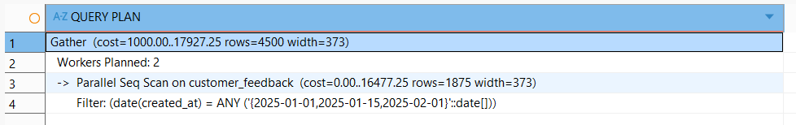
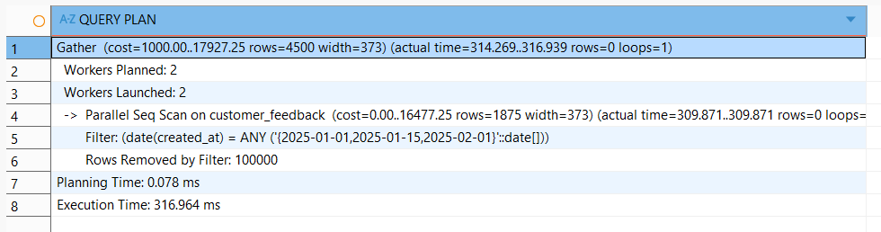
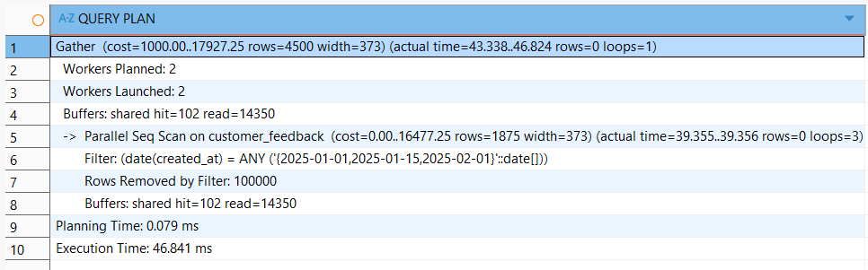
#### С индексом b-tree:
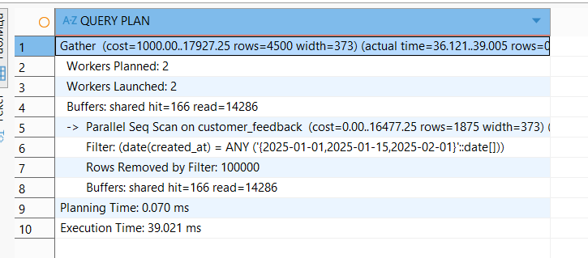
#### С индексом hash:
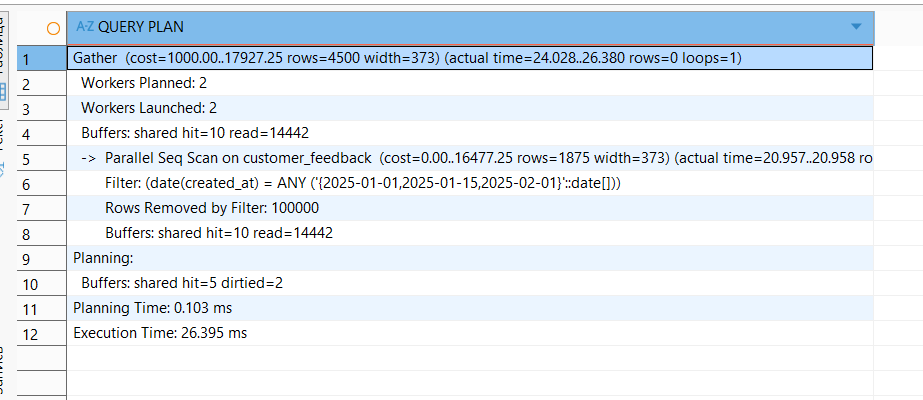

