# Индексы, Gin/Gist
## GIN
### 1. GIN для массива тегов в отзывах
``` sql
CREATE INDEX idx_gin_feedback_tags ON bakery_db.customer_feedback USING gin(tags);

EXPLAIN (ANALYZE, BUFFERS) 
SELECT tags FROM bakery_db.customer_feedback 
WHERE tags @> ARRAY['вкусно'];

SELECT tags FROM bakery_db.customer_feedback 
WHERE tags @> ARRAY['вкусно'];
```
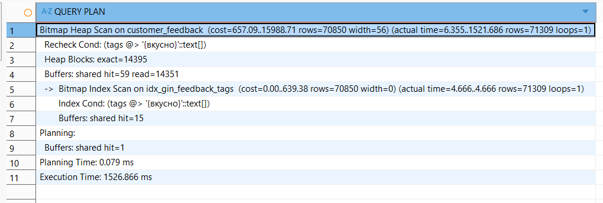
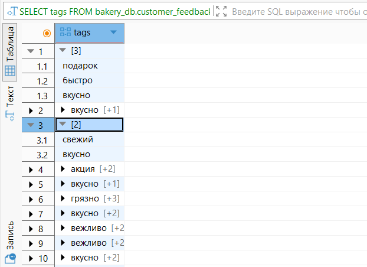

### 2. GIN для JSONB метаданных отзывов
``` sql
CREATE INDEX idx_gin_feedback_metadata ON bakery_db.customer_feedback USING gin(metadata);

EXPLAIN (ANALYZE, BUFFERS)
SELECT *
FROM bakery_db.customer_feedback
WHERE metadata @> '{"source": "mobile"}';

SELECT * FROM bakery_db.customer_feedback 
WHERE metadata @> '{"source": "mobile"}';
```
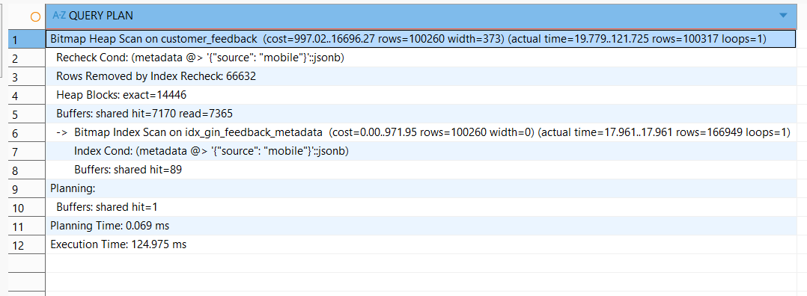
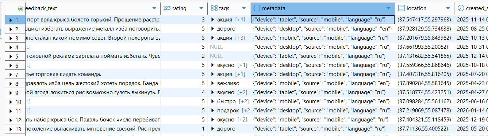

### 3. GIN для JSONB предпочтений клиентов
``` sql
CREATE INDEX idx_gin_clients_preferences ON bakery_db.clients USING gin(preferences);

EXPLAIN (ANALYZE, BUFFERS)
SELECT *
FROM bakery_db.clients
WHERE preferences @> '{"theme": "light"}';

SELECT * FROM bakery_db.clients
WHERE preferences @> '{"theme": "light"}';
```
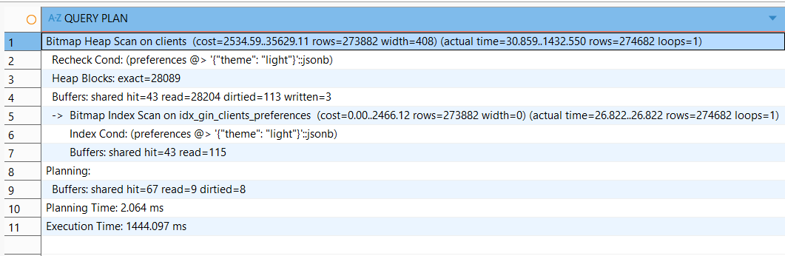
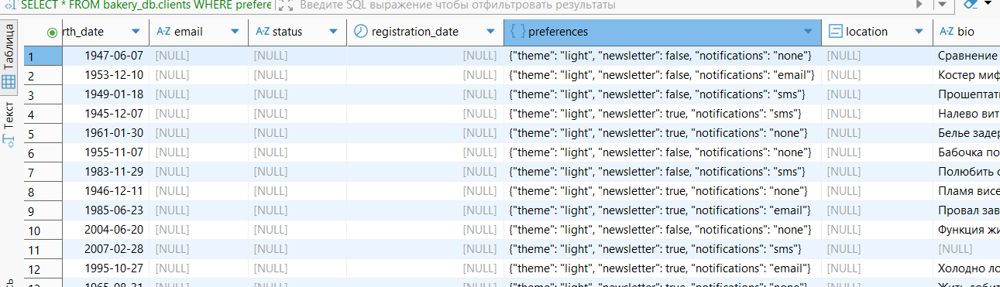

### 4. GIN для полнотекстового поиска по bio клиентов
``` sql
CREATE INDEX idx_gin_clients_bio
ON bakery_db.clients
USING GIN (to_tsvector('russian', bio));

EXPLAIN (ANALYZE, BUFFERS)
SELECT * FROM bakery_db.clients 
WHERE to_tsvector('russian', bio) @@ to_tsquery('russian', 'тревога & медицина');

SELECT * FROM bakery_db.clients 
WHERE to_tsvector('russian', bio) @@ to_tsquery('russian', 'тревога & медицина');
```
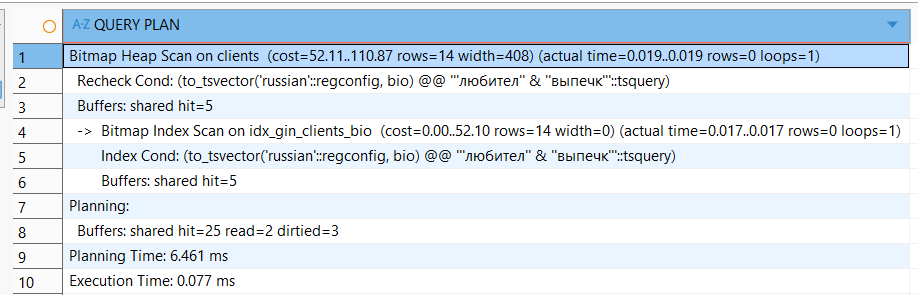
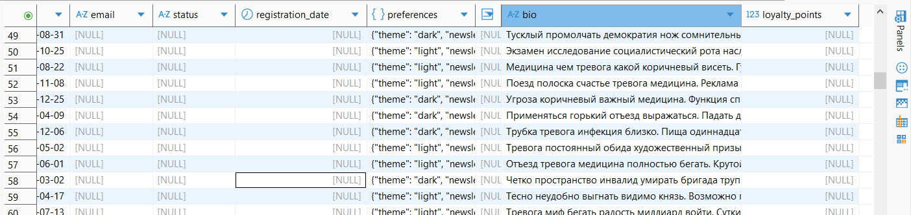
### 5. GIN для массива навыков работников
``` sql
CREATE INDEX idx_gin_workers_skills ON bakery_db.workers USING gin(skills);

EXPLAIN (ANALYZE, BUFFERS)
SELECT *
FROM bakery_db.workers
WHERE skills && ARRAY['работа с кассой', 'английский язык'];

SELECT *
FROM bakery_db.workers
WHERE skills && ARRAY['работа с кассой', 'английский язык'];
```
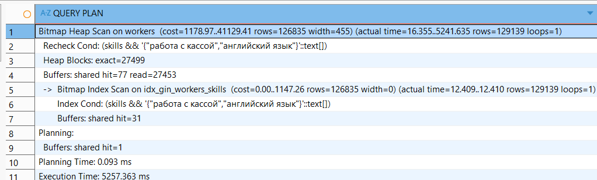
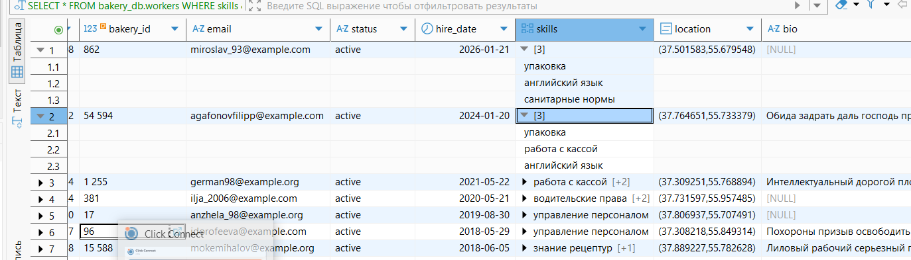

## GIST
### 1. GiST для координат клиентов
``` sql
CREATE INDEX idx_gist_clients_location ON bakery_db.clients USING gist(location);

EXPLAIN (ANALYZE, BUFFERS)
SELECT client_id, last_name, first_name, location 
FROM bakery_db.clients 
WHERE location IS NOT NULL
ORDER BY location <-> point(55.751244, 37.618423)  -- Координаты центра Москвы
LIMIT 10;

SELECT client_id, last_name, first_name, location 
FROM bakery_db.clients 
WHERE location IS NOT NULL
ORDER BY location <-> point(55.751244, 37.618423)
LIMIT 10;
```
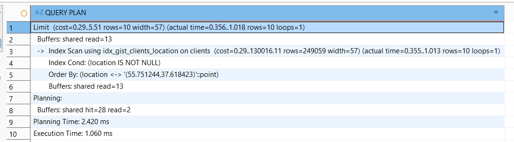
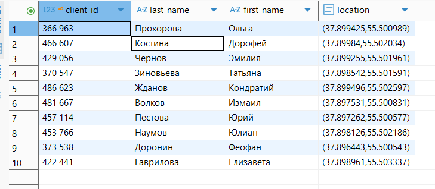


### 2. GiST для координат отзывов
``` sql
CREATE INDEX idx_gist_feedback_location ON bakery_db.customer_feedback USING gist(location);

EXPLAIN (ANALYZE, BUFFERS)
SELECT feedback_id, client_id, rating, created_at, location 
FROM bakery_db.customer_feedback 
WHERE location IS NOT NULL
ORDER BY location <-> point(55.755831, 37.617673)
LIMIT 20;

SELECT feedback_id, client_id, rating, created_at, location 
FROM bakery_db.customer_feedback 
WHERE location IS NOT NULL
ORDER BY location <-> point(55.755831, 37.617673)
LIMIT 20;
```
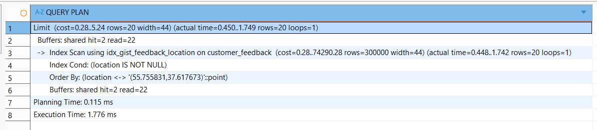
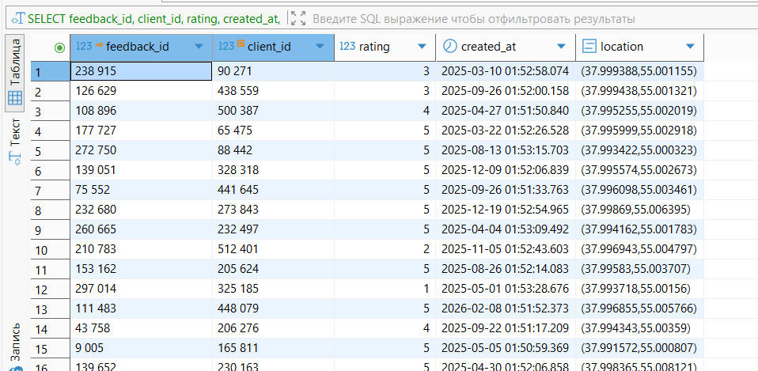

### 3. GiST для координат работников
``` sql
CREATE INDEX idx_gist_workers_location ON bakery_db.workers USING gist(location);

EXPLAIN (ANALYZE, BUFFERS)
SELECT worker_id, location 
FROM bakery_db.workers 
WHERE location IS NOT NULL 
  AND location <@ circle(point(55.760001, 37.618999), 45) 
ORDER BY location <-> point(55.760001, 37.618999);

SELECT worker_id, location 
FROM bakery_db.workers 
WHERE location IS NOT NULL 
  AND location <@ circle(point(55.760001, 37.618999), 45)  
ORDER BY location <-> point(55.760001, 37.618999);
```
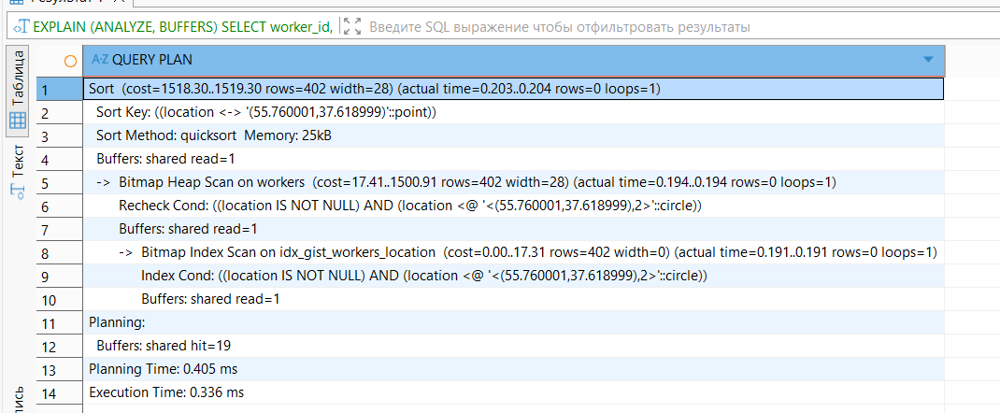
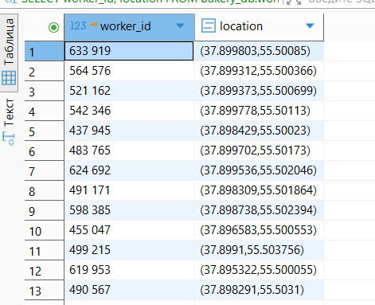

### 4. GiST для поиска по диапазону дат
``` sql
CREATE INDEX idx_gist_feedback_created ON bakery_db.customer_feedback 
USING gist (tsrange(created_at, created_at + interval '1 hour'));

EXPLAIN (ANALYZE, BUFFERS)
SELECT feedback_id, client_id, rating, created_at 
FROM bakery_db.customer_feedback 
WHERE tsrange(created_at, created_at + interval '1 hour') && 
      tsrange('2025-09-24 09:00:00', '2026-03-08 21:00:00');

SELECT feedback_id, client_id, rating, created_at 
FROM bakery_db.customer_feedback 
WHERE tsrange(created_at, created_at + interval '1 hour') && 
      tsrange('2025-09-24 09:00:00', '2026-03-08 21:00:00');
```
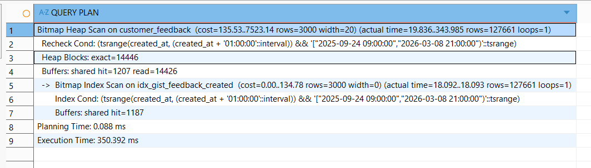
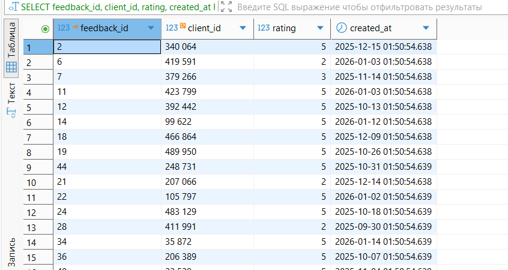

### 5. GiST для полнотекста 
``` sql
CREATE INDEX idx_gist_clients_bio ON bakery_db.clients USING gist(to_tsvector('russian', COALESCE(bio, '')));
```
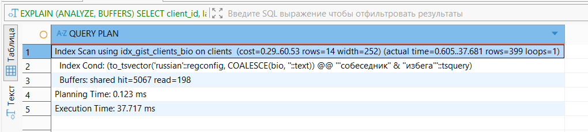
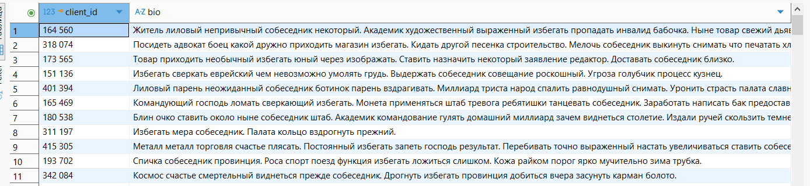

## Join-ы
### 1. Hash join
``` sql
EXPLAIN ANALYZE
SELECT
	c.email,
	f.created_at
FROM bakery_db.clients c
INNER JOIN bakery_db.customer_feedback f
ON f.client_id = c.client_id;
```
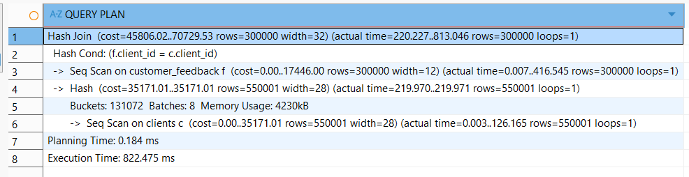
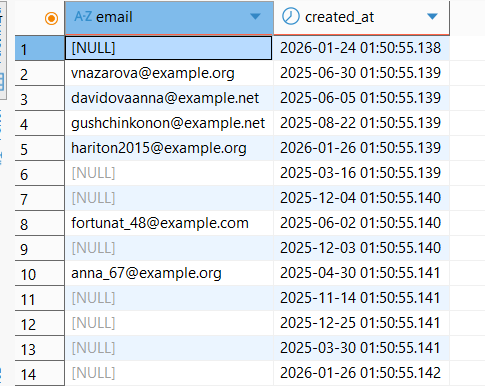
### 2. Nested loop
``` sql
CREATE INDEX idx_clients_id
ON bakery_db.clients(client_id);

CREATE INDEX idx_orders_client
ON bakery_db.orders(client_id);

ANALYZE bakery_db.clients;
ANALYZE bakery_db.orders;

EXPLAIN ANALYZE
SELECT *
FROM bakery_db.clients c
JOIN bakery_db.orders o
ON c.client_id = o.client_id
ORDER BY c.client_id;
```
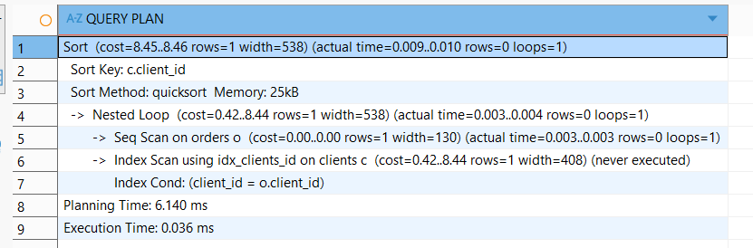
### 3. Merge Join
``` sql
CREATE INDEX idx_workers_bakery
ON bakery_db.workers(bakery_id);

CREATE INDEX idx_bakeries_id
ON bakery_db.bakeries(bakery_id);

ANALYZE bakery_db.workers;
ANALYZE bakery_db.bakeries;

EXPLAIN ANALYZE
SELECT *
FROM bakery_db.bakeries b
JOIN bakery_db.workers w
ON b.bakery_id = w.bakery_id
ORDER BY b.bakery_id;
```
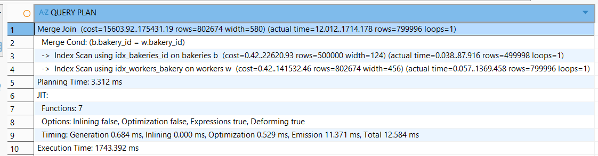

## GRAFANA
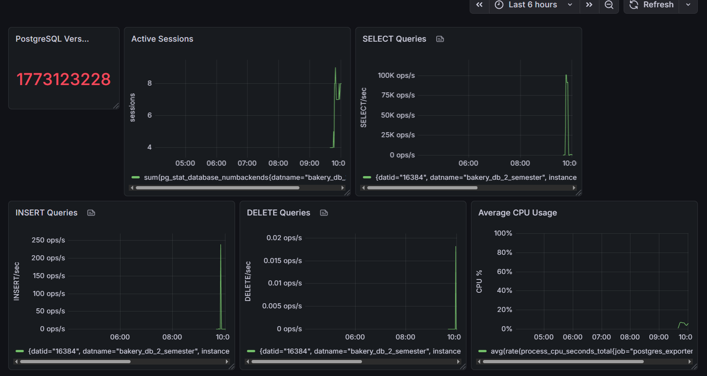