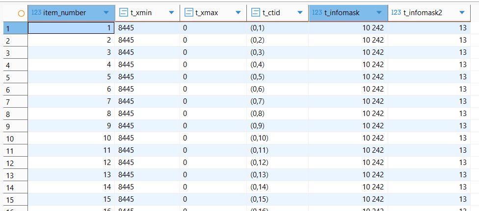
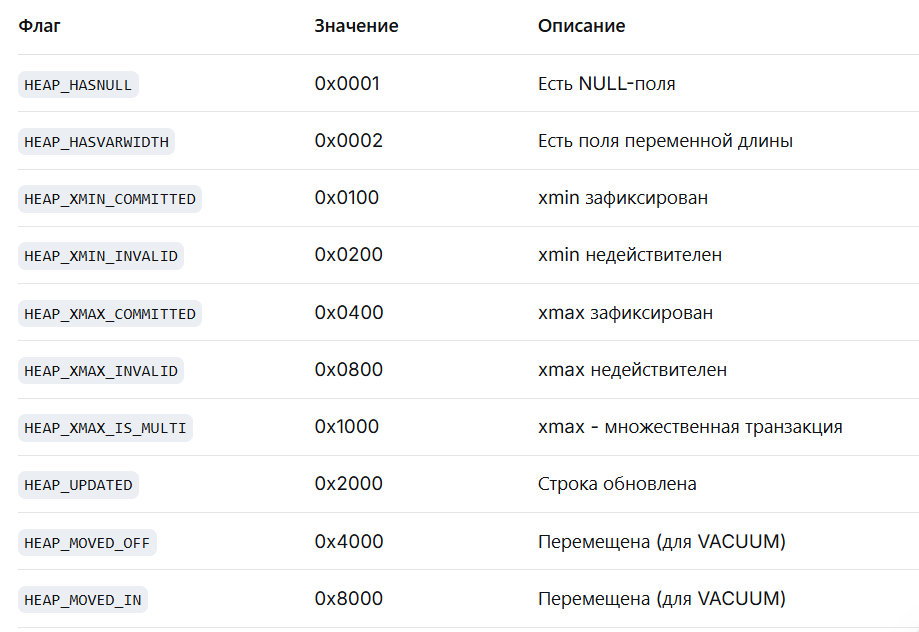
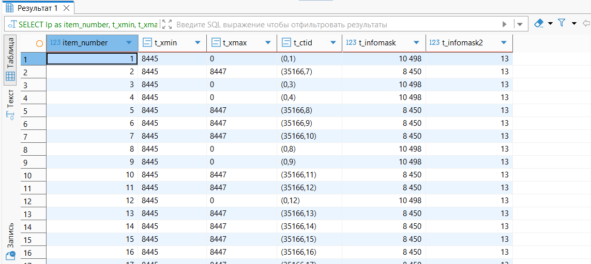
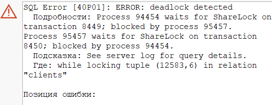
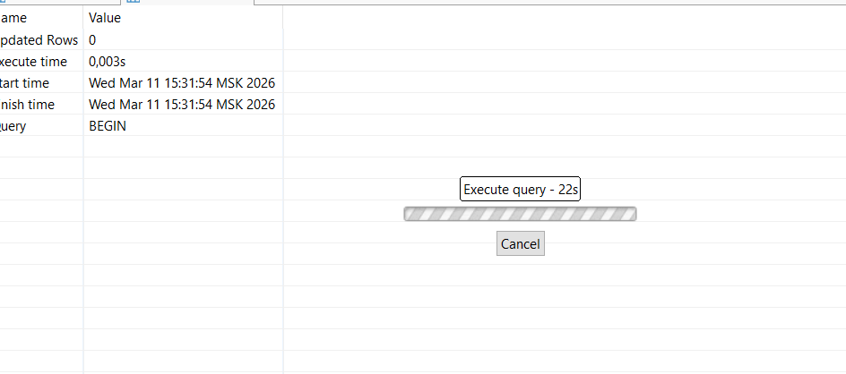

## Задание: Смоделировать обновление данных и посмотреть на параметры xmin, xmax, ctid, t_infomask
``` sql
CREATE EXTENSION IF NOT EXISTS pageinspect;

SELECT 
    lp as item_number,
    t_xmin,
    t_xmax,
    t_ctid,
    t_infomask::integer,
    t_infomask2::integer
FROM heap_page_items(get_raw_page('bakery_db.clients', 0));

begin;
update bakery_db.clients 
set loyalty_points =+ 10
where birth_date < '12/11/2022';
commit;
```

## 2. Понять что хранится в t_infomask
По значению t_infomask можно определить:
1. Зафиксирована ли транзакция создания (HEAP_XMIN_COMMITTED)

2. Удалена ли строка (HEAP_XMAX_INVALID / HEAP_XMAX_COMMITTED)

3. Есть ли NULL-поля (HEAP_HASNULL)

4. Была ли строка обновлена (HEAP_UPDATED)

5. Заблокирована ли строка (HEAP_XMAX_IS_MULTI)
   


## 3. Посмотреть на параметры из п1 в разных транзакциях
``` sql
-- Первая транзакция
begin;
update bakery_db.clients 
set loyalty_points =+ 10
where birth_date < '12/11/1979';
-- Не заканчиваем
-- Вторая транзакция
begin;
select * from bakery_db.clients 
where birth_date < '12/11/1990';
commit;
-- Заканчиаем первую
commit;
SELECT 
    lp as item_number,
    t_xmin,
    t_xmax,
    t_ctid,
    t_infomask::integer,
    t_infomask2::integer
FROM heap_page_items(get_raw_page('bakery_db.clients', 0));
```

## 4. deadlock
``` sql
-- Сессия 1
BEGIN;
SELECT * FROM bakery_db.clients WHERE client_id = 1 FOR UPDATE;

-- Сессия 2
BEGIN;
SELECT * FROM bakery_db.clients WHERE client_id = 2 FOR UPDATE;

-- Сессия 1 (теперь пытаемся заблокировать то, что во 2-ой)
SELECT * FROM bakery_db.clients WHERE client_id = 2 FOR UPDATE;
-- (зависает)

-- Сессия 2 (создаем deadlock)
SELECT * FROM bakery_db.clients WHERE client_id = 1 FOR UPDATE;
-- ERROR: deadlock detected
```


## 5. Блокировки
``` sql
-- Сессия 1
BEGIN;
LOCK TABLE bakery_db.clients IN SHARE MODE;
-- Держим блокировку


-- Сессия 2
BEGIN;
-- оба зависли
LOCK TABLE bakery_db.clients IN ROW EXCLUSIVE MODE; 
LOCK TABLE bakery_db.clients IN ACCESS EXCLUSIVE MODE;
```


## 6. Очистка данных
``` sql
BEGIN;

TRUNCATE bakery_db.customer_feedback CASCADE;
TRUNCATE bakery_db.clients CASCADE;
TRUNCATE bakery_db.workers CASCADE;
TRUNCATE bakery_db.bakeries CASCADE;

COMMIT;
```